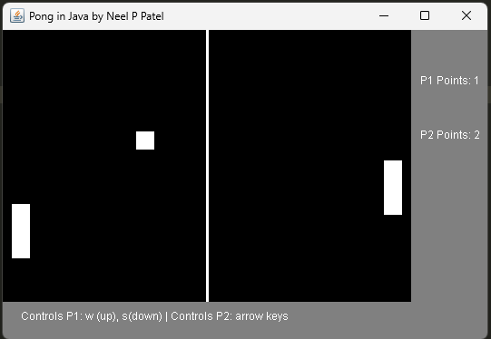

# Pong-in-Java-by-Neel-P-Patel

This is the basic game of pong which I recreated using java.
Users can simply download these files, move them onto a compiler and run it for the game to open up.
A new window will appear on the users screen allowing them the abilities to control both paddles.
"arrows up" and "arrow down" control the right paddle while
"w" and "s" control the left paddle.

First player to 5 points will win!

